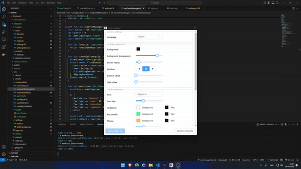

# Keysee

**Keysee** is a free and open-source tool that displays real-time keyboard and mouse input on screen. 

## Why use Keysee?

During tutorials or live demos, it's not always clear what keys or buttons are being used.
Keysee provides simple, clear input visuals without distracting from the main content.

## Features

- Displays keys, mouse buttons, and scroll events
- Filters out noise (like repeated keys)
- Detects combos (e.g. Ctrl + Shift + Z)
- Optional ripple effects for mouse clicks
- Customizable appearance

## Notes
- ⚠️ Some antivirus software may flag this app because it uses system hooks to detect keyboard and mouse input.
The code is open-source, and nothing is sent anywhere — no tracking, no network activity.
If you're unsure, you can [you can build it yourself](BUILD.md). Totally up to you.
- For now, the app is available for Windows 10/11 only.

## Download

[Download for Windows 10+](https://github.com/Sakhnovkrg/Keysee-App/releases/latest)

## License

[MIT License](LICENSE)

## Project Structure

| Component  | Purpose                          | Tech Stack                               |
|------------|----------------------------------|------------------------------------------|
| `backend/` | Low-level input capture engine   |  |
| `frontend/`| Visual overlay application       |   |
